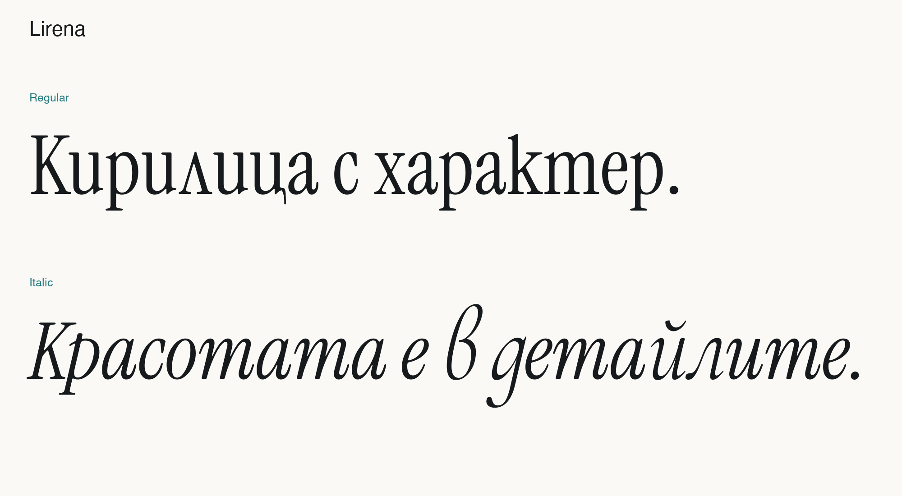

# Lirena

Bulgarian Cyrillic adaptation of Instrument Serif by **Stiliyan Spasov / Spasov Type**. Regular and true Italic, with Bulgarian Cyrillic, Latin, numerals and punctuation. Designed for titles and editorial text.

**First stable release — v1.0.0**

[Try Lirena](https://spasovtype.com/) · [Download](https://github.com/stilliyan/lirena/releases/latest)



## Use

For desktop use, install the two TTF files in `fonts/` and select Lirena.
For the web, keep the WOFF2 files beside `fonts.css` and load the stylesheet:

```html
<link rel="stylesheet" href="fonts/fonts.css">
```

```css
body { font-family: 'Lirena', serif; }
em { font-style: italic; }
```

## Credits and license

Based on [Instrument Serif](https://github.com/Instrument/instrument-serif) and selected Bulgarian forms from [Cormorant Garamond](https://github.com/CatharsisFonts/Cormorant). Original Latin outlines and spacing are retained.

Released under the **SIL Open Font License 1.1**. Both original licenses are included in [`licenses/`](licenses/); attribution is in [AUTHORS.txt](AUTHORS.txt).

## Build from source

```sh
python -m pip install -r requirements.txt
python scripts/build.py
```

Source fonts and adaptation scripts are included. Rebuilt files are written to `build/`.
