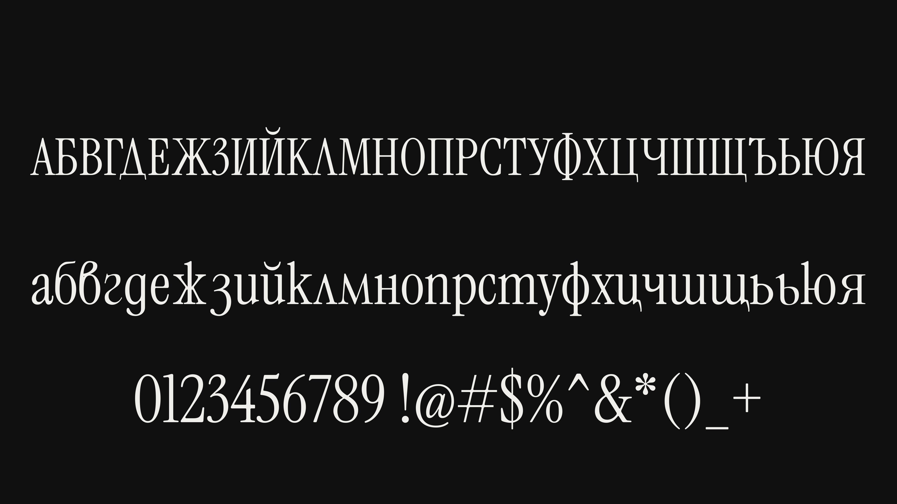
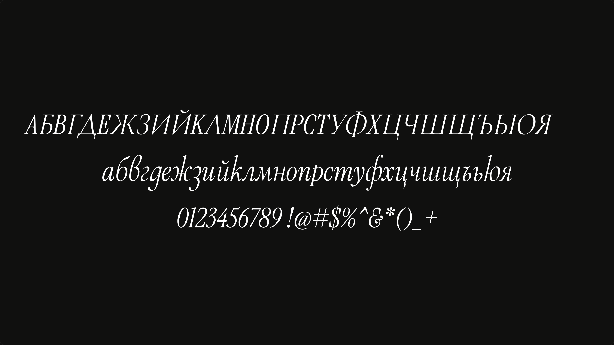

# Lirena

Bulgarian Cyrillic adaptation of Instrument Serif.

**Cyrillic adaptation by Stiliyan Spasov / Spasov Type.**

[Try the typeface](https://spasovtype.com/) · [Portfolio](https://www.stiliyanspasov.com/) · [Download the release](https://github.com/stilliyan/lirena/releases/latest)

## Regular



## Italic



## Styles and formats

Regular 400 and true Italic 400, each available as TTF and WOFF2 in `fonts/`.
Includes the Bulgarian uppercase and lowercase alphabet, Й/й and Ѝ/ѝ, alongside the original Latin, numerals and punctuation. Bulgarian forms are the defaults in both styles. Other Cyrillic alphabets are outside this adaptation's scope.

## Desktop installation

Install `fonts/Lirena-Regular.ttf` and `fonts/Lirena-Italic.ttf` using your operating system's font installer. Select **Lirena**, then Regular or Italic. Restart applications that cache their font lists.

## Web use

Keep both WOFF2 files beside `fonts.css`, then load the stylesheet:

```html
<link rel="stylesheet" href="fonts/fonts.css">
<p class="specimen" lang="bg">Кирилица с характер.</p>
```

```css
.specimen {
  font-family: 'Lirena', serif;
  font-weight: 400;
  font-synthesis: none;
}
.specimen em { font-style: italic; }
```

## Sources and adaptation

Lirena is the new name of the project previously published as Instrument Serif Cyrillic. The new name identifies the independent adaptation; it does not change the original authorship of Instrument Serif or Cormorant Garamond.

This independent adaptation is based on **Instrument Serif** and **Cormorant Garamond**. It is not an official release of either original project.

- Instrument Serif's original Latin outlines and spacing are preserved. Shared Cyrillic forms reuse those outlines, including Latin **m** adapted as Bulgarian **т**.
- Distinct Bulgarian forms, including **д** and **ж**, use Cormorant Garamond's Bulgarian forms, adapted to Instrument Serif's proportions.
- The Cyrillic work includes proportion matching, italic slant adjustment, Cyrillic spacing, accented-letter composition and shared vertical metrics for the two styles.

Intended for titles and short editorial passages. Test your intended text and rendering environment before use.

## Website

The interactive specimen is at [spasovtype.com](https://spasovtype.com/).
Its complete source is in [`website/`](website/), including the HTML, CSS,
JavaScript, fonts, glyph comparison assets and downloadable font package.

```sh
cd website
npm start
```

Open http://127.0.0.1:3040/. See [the website README](website/README.md) for
hosting settings.

## Rebuild the adaptation

The actual adaptation scripts and the four source TTFs are included. The original development scripts have been reduced to font generation and validation; local paths and unrelated specimen-generation dependencies have been removed.

```sh
python3 -m venv .venv
source .venv/bin/activate
python -m pip install -r requirements.txt
python scripts/build.py
```

Rebuilt fonts are written to `build/`; the published files in `fonts/` are left untouched. The scripts check original outlines, Bulgarian glyph coverage, decomposed accents and Latin shaping. Rebuilds can differ in timestamps, serialization and metadata from the distributed files.

## Credits and licenses

- Copyright 2022 The Instrument Serif Project Authors. [Instrument Serif](https://github.com/Instrument/instrument-serif). Original Instrument Serif design and Latin outlines. Designed by Rodrigo Fuenzalida, with direction from Jordan Egstad, JD Hooge and Jack De Caluwé on behalf of Instrument.
- Copyright 2015 the Cormorant Project Authors. [Cormorant](https://github.com/CatharsisFonts/Cormorant). Source Bulgarian forms from Cormorant Garamond, designed by Christian Thalmann / Catharsis Fonts.
- Cyrillic adaptation by **Stiliyan Spasov / Spasov Type**. Bulgarian Cyrillic proportions, italic slant, spacing and paired styles.

All included font software, including the source fonts, is distributed under the **SIL Open Font License 1.1**. Both original licenses and copyright notices are included unchanged in `licenses/`. See [AUTHORS.txt](AUTHORS.txt) for attribution. Original authors retain their copyright; credit does not imply their approval or endorsement. No paid or exclusive license is added.
